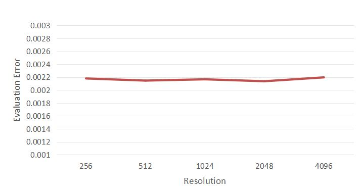

# Koopman Neural Operator Solves 1D Burgers Equation

## Overview

### Problem Description

Burgers' equation is a nonlinear partial differential equation that simulates the propagation and
reflection of shock waves. It is widely used in the fields of fluid mechanics, nonlinear acoustics,
gas dynamics et al. It is named after Johannes Martins Hamburg (1895-1981).

The 1-d Burgers’ equation applications include modeling the one dimensional flow of a viscous fluid.
It takes the form

$$
\partial_t u(x, t)+\partial_x (u^2(x, t)/2)=\nu \partial_{xx} u(x, t), \quad x \in(0,1), t \in(0, 1]
$$

$$
u(x, 0)=u_0(x), \quad x \in(0,1)
$$

where $u$ is the velocity field, $u_0$ is the initial condition and $\nu$ is the viscosity coefficient.

We aim to learn the operator mapping the initial condition to the solution at time one:

$$
u_0 \mapsto u(\cdot, 1)
$$

### Technical Path

The following figure shows the architecture of the Koopman Neural Operator, which contains the upper and lower main branches and corresponding outputs. In the figure, Input represents the initial vorticity. In the upper branch, the input vector is lifted to higher dimension channel space by the Encoding layer. Then the mapping result is used as the input of the Koopman layer to perform nonlinear transformation of the frequency domain information. Finally, the Decoding layer maps the transformation result to the Prediction. At the same time, the lower branch does high-dimensional mapping of the input vector through the Encoding Layer, and then reconstructs the input through the Decoding Layer. The Encoding layers of the upper and lower branches share the weight, and the Decoding layers share the weight too. Prediction is used to calculate the prediction error with Label, and Reconstruction is used to calculate the reconstruction error with Input. The two errors together guide the gradient calculation of the model.

The Koopman Neural Operator consists of the Encoding Layer, Koopman Layers, Decoding Layer and two branches.

The Koopman Layer is shown in the dotted box, which could be repeated. Start from input: apply the Fourier transform(FFT); apply a linear transformation on the lower Fourier modes and filters out the higher modes; then apply the inverse Fourier transform(iFFT). Then the output is added into input. Finally, the Koopman Layer output vector is obtained through the activation function.


## QuickStart

You can download dataset from [data_driven/airfoil/2D_steady](https://download.mindspore.cn/mindscience/mindflow/dataset/applications/data_driven/airfoil/2D_steady/) for model evaluation. Save these dataset at `./dataset`.

### Run Method 1: Call `train.py` from command line

```shell
python train.py --config_file_path ./configs/kno1d.yaml --mode GRAPH --device_target Ascend --device_id 0
```

where:

`--config_file_path` indicates the path of the parameter file. Default './configs/kno1d.yaml'；

`--device_target` indicates the computing platform. You can choose 'Ascend' or 'GPU'. Default 'Ascend'.

`--device_id` indicates the index of NPU or GPU. Default 0.

`--mode` is the running mode. 'GRAPH' indicates static graph mode. 'PYNATIVE' indicates dynamic graph mode.

### Run Method 2: Run Jupyter Notebook

You can run the training and validation code line by line using the Chinese or English version of the Jupyter Notebook [Chinese Version](KNO1D_CN.ipynb) and [English Version](KNO1D.ipynb).

## Results Display

Take 6 samples, and do 10 consecutive steps of prediction. Visualize the prediction as follows.


## Performance

| Parameter               | Ascend               | GPU                |
|:----------------------:|:--------------------------:|:---------------:|
| Hardware                | Ascend, 32G            | NVIDIA V100, 32G    |
| MindSpore version           | >=2.0.0                 | >=2.0.0                   |
| Dataset                  | [1D Burgers Equation 256 Resolution Dataset](https://download-mindspore.osinfra.cn/mindscience/mindflow/dataset/applications/data_driven/burgers/)      | [1D Burgers Equation 256 Resolution Dataset](https://download-mindspore.osinfra.cn/mindscience/mindflow/dataset/applications/data_driven/burgers/)                   |
| Parameters                  | 1.3e5                   | 1.3e5                   |
| Train Config                | channels=8, modes=10, depth=10, batch_size=64, steps_per_epoch=125, epochs=15000 | channels=8, modes=10, depth=10, batch_size=64, steps_per_epoch=125, epochs=15000 |
| Evaluation Config                | batch_size=64          | batch_size=64               |
| Optimizer                  | Adam                 | Adam                   |
| Train Loss(MSE)           | 1e-06                | 6e-05             |
| Evaluation Error(RMSE)          | 0.002197                | 0.223467             |
| Speed(ms/step)           |20                   | 30               |

The datasets at different resolutions are taken for testing and according to the following results it can be concluded that the dataset resolution has no effect on the training results.



## Contributor

gitee id：[dyonghan](https://gitee.com/dyonghan), [yezhenghao2023](https://gitee.com/yezhenghao2023)

email: dyonghan@qq.com, yezhenghao@isrc.iscas.ac.cn
