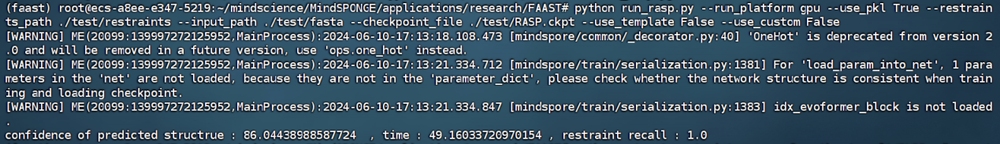
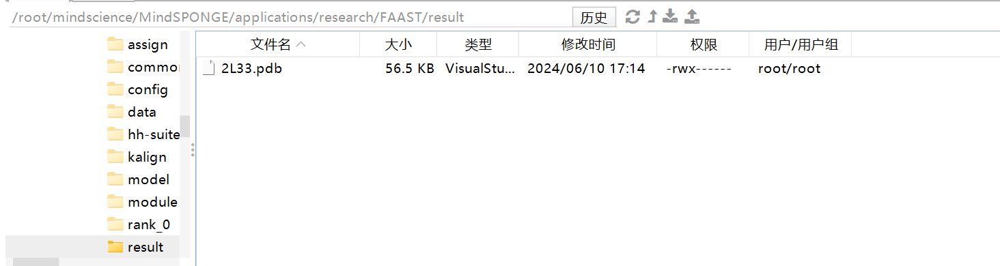
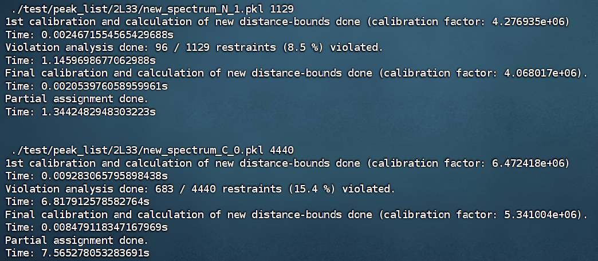
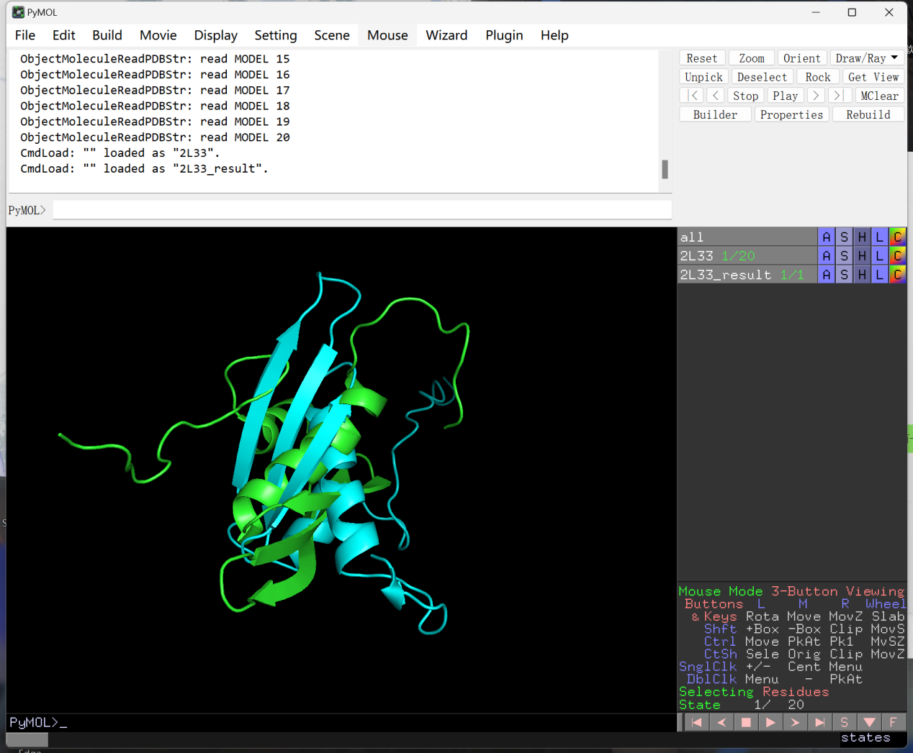
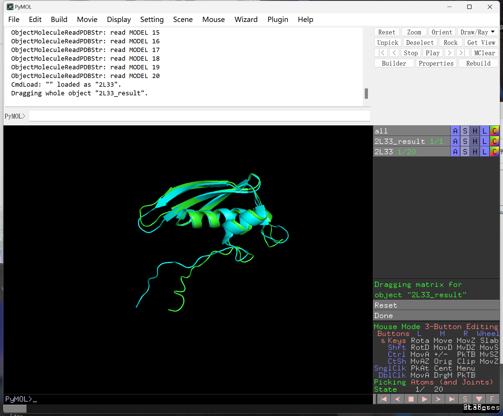
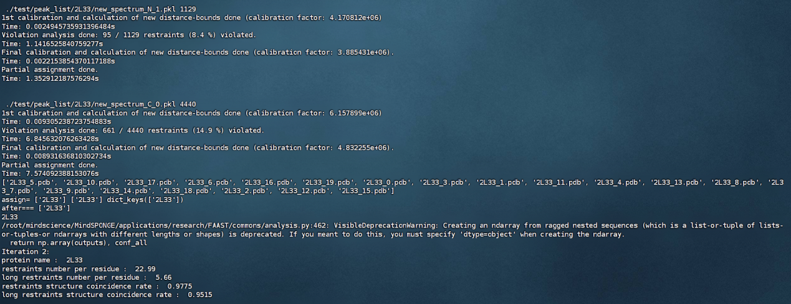
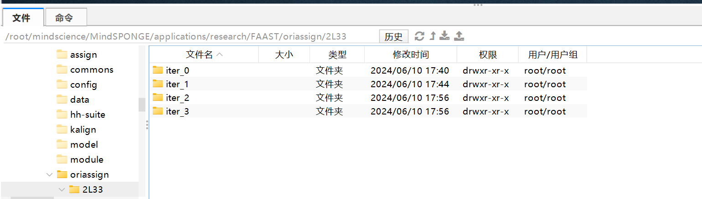

# 论文Assisting and Accelerating NMR Assignment with Restrained Structure Prediction复现

## 1. RASP模型介绍

RASP(Restraints Assisted Structure Predictor)，约束辅助结构预测器模型，能够用于不同的应用，包括改进多结构域蛋白和那些具有少量msa的蛋白的结构预测。

结构：为了纳入约束信息，论文开发了来自AlphaFold2诱发形成器和结构模块的RASP模型。另外还增加了4个利用约束信息的偏差：成对偏差、MSA偏差、IPA偏差和结构偏差用来处理残差间约束作为边缘信息。前3个偏差采用了对进化形成器和IPA模块的边缘偏差，这种残留间的信息可以自然地转换为形状的特征，类似于原始模型的演进器模块中的对激活。残差间信息和每个残差信息的合并也发生在关注点不变问题中。接触信息以与IPA偏差相同的方式作为IPA偏差添加到IPA注意权重矩阵中。除了关注点中的偏差外，在结构生成过程中还引入了一个额外的偏差。在生成三维结构时，将约束信息识别出的近残基对移到近距离，而通过优化残基对来拉出AlphaFold2的违损距离。

## 2. 数据集介绍

以下关于2L33蛋白质数据集的各类信息。

1）**2L33蛋白质的约束信息：./restraints/2L33.txt**

该文件可能包含2L33蛋白质在实验过程中的约束条件

2）**2L33蛋白质序列化文件：./pkl/2L33.pkl**

.pkl 文件是 Python 中用于序列化和反序列化对象的常见格式。该文件包含了2L33蛋白质的结构、属性和其他相关数据。

3）**2L33蛋白质提供约束信息的pdb文件：./pdb/2L33.pdb**

PDB文件是存储蛋白质和其他生物大分子三维结构信息的标准格式。该文件中包含了2L33蛋白质的详细三维结构信息，这些信息包括原子坐标、化学键类型、生物大分子的组成等。PDB文件通常用于可视化蛋白质结构、进行结构分析以及与其他生物大分子进行比较。

4）**RASP模型权重：RASP.ckpt**

该文件包含了包含了该模型训练过程中学习到的权重参数

## 3. 基于GPU平台mindspore安装（推荐使用Ascend910平台，gpu平台所需cudnn已被弃用）

本工具可以在Ascend910或16G以上内存的GPU上运行，基于Ascend运行时默认调用混合精度，基于GPU运行时使用全精度计算。

安装gpu平台支持的最新版mindspore2.2.14，配置所需环境变量

| 软件名称                                                                                    | 版本       | 作用                                                          |
|---------------------------------------------------------------------------------------------|------------|---------------------------------------------------------------|
| Ubuntu                                                                                      | 18.04      | 编译和运行MindSpore的操作系统                                 |
| [CUDA](https://www.mindspore.cn/install/#%E5%AE%89%E8%A3%85cuda)                            | 11.1       | MindSpore GPU使用的并行计算架构                               |
| [cuDNN](https://www.mindspore.cn/install/#%E5%AE%89%E8%A3%85cudnn)                          | 8.0.4      | MindSpore GPU使用的深度神经网络加速库                         |
| [Python](https://www.mindspore.cn/install/#%E5%AE%89%E8%A3%85python)                        | 3.7        | MindSpore的使用依赖Python环境                                 |
| [GCC](https://www.mindspore.cn/install/#%E5%AE%89%E8%A3%85gcc%E5%92%8Cgmp)                  | 9.4.0      | 用于编译MindSpore的C++编译器                                  |
| [TensorRT](https://www.mindspore.cn/install/#%E5%AE%89%E8%A3%85tensorrt-%E5%8F%AF%E9%80%89) | 7.2.2或8.4 | MindSpore使用的高性能深度学习推理SDK（可选，Serving推理需要） |

## 4. 安装所需依赖

**安装MindSPONGE: 下载 Mindscience仓，并编译 MindSPONGE包**：

git clone https://gitee.com/mindspore/mindscience.git

cd ./mindscience/MindSPONGE/

bash build.sh -e gpu -j 8

pip install ./output/mindsponge\*.whl

**安装其它依赖包： 本工具依赖hhsearch 与 kalign 等搜索工具，可通过一键安装脚本自动配置**

cd ./mindscience/MindSPONGE/applications/research/FAAST

sh ./install.sh

## 5. 代码运行步骤

**约束信息结构预测模型运行示例**：

启动推理：

python run_rasp.py --run_platform gpu --use_pkl True --restraints_path ./test/restraints --input_path ./test/pkl --checkpoint_file ./test/RASP.ckpt --use_template False --use_custom False

选项：

\--restraints_path 约束信息文件夹位置，其中单个约束信息文件以txt形式保存

\--run_platform 运行平台，可选Ascend或GPU

\--input_path 输入文件夹目录，可包含多个.fasta/.pkl文件

\--checkpoint_file 模型权重文件路径

\--use_pkl 使用pkl数据作为输入，默认False

\--use_template 是否使用template信息， 默认True

\--use_custom 是否使用搜索好的msa信息与template信息, 默认False

\--a3m_path 搜索后保存的的a3m文件夹位置，或者直接提供的a3m文件路径位置

\--template_path 搜索后保存的cif文件位夹置，或者直接提供的cif文件路径位置

RASP模型支持三种模式的输入:

1、输入原始fasta序列，通过在线mmseqs检索得到MSA和template，需要将use_pkl与use_custom设为False，同时输入a3m_path与template_path作为保存搜索结果的路径;

2、输入用户提供的MSA与template文件，其中MSA为a3m格式，template为cif格式，可以由用户自行检索或者由经验知识提供；需要将use_pkl设为False 与use_custom设为True,同时输入用户提供的MSA和template路径a3m_path 与 template_path;

3、输入提前预处理好得到的pkl文件，需要将use_pkl设为True，不需要额外输入a3m_path与template path。

约束信息：

python extract_restraints.py --pdb_path PDB_PATH --output_file OUTPUT_FILE

选项：

\--pdb_path 提供约束信息的pdb文件

\--output_file 输出约束信息的文件位置

RASP预测模型运行日志及可信度结果：

结果存放目录：

### FAAST-NMR数据自动解析方法运行示例

启动推理：

python main.py --run_platform GPU --use_pkl True --peak_and_cs_path ./test/peak_list/2L33 --input_path ./test/fasta --checkpoint_file ./test/RASP.ckpt --use_template True --use_custom False --a3m_path ./test --template_path ./test

选项：

\--peak_and_cs_path 化学位移表和NOESY谱峰列表所在路径

\--run_platform 运行平台，可选Ascend或GPU

\--input_path 输入文件目录，可包含多个.fasta/.pkl文件

\--checkpoint_file 模型权重文件路径

\--use_pkl 使用pkl数据作为输入，默认False

\--use_template 是否使用template信息， 默认True

\--use_custom 是否使用搜索好的msa信息与template信息, 默认False

\--a3m_path 搜索后保存的的a3m文件夹位置，或者直接提供的a3m文件路径位置

\--template_path 搜索后保存的cif文件位夹置，或者直接提供的cif文件路径位置

迭代过程图如下：

## 6. 实验结果

### 约束信息结构预测模型

**预测蛋白质结构图（绿）和原始蛋白质结构图（蓝）**

旋转修正后：

**预测蛋白质结构图（绿）和原始蛋白质结构图（蓝）**

可以看出RASP模型推理得到结果接近真实结构

### FAAST-NMR数据自动解析方法运行示例

日志运行记录：

解析过程文件：

Protein name是该蛋白的名字。，number of input restraint pair是有效的输入的约束信息数量，confidence 是所得结构的可信度，0为完全不可信，100为非常可信，可信度与结构质量正相关（相关系数\>0.65），input restraint recall是指推理所得结构与输入约束信息的符合率。long restraints是指蛋白质一级序列中残基编号距离大于等于4的残基对约束信息。
